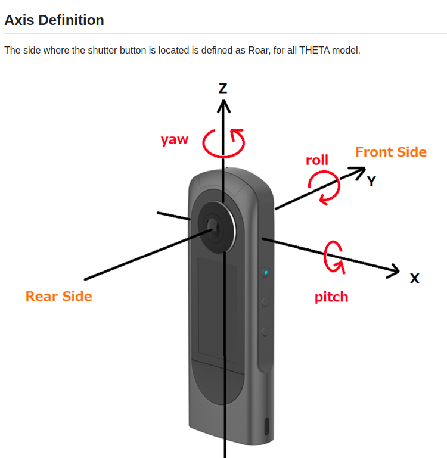

# Richo
- API : [git](https://github.com/ricohapi/theta-api-specs/blob/main/theta-web-api-v2.1/protocols/commands_execute.md)
 
# Connect
1. cammera model wifi connect 
2. 
```bash
ping 192.168.1.1 # to check app 

curl http://192.168.1.1/osc/info
curl -X POST http://192.168.1.1/osc/state

```

## Theta Metadata 
- Axis Definition


- camm track 
```
RICOH THETA X
8K (7680x3840px) 10fps, 5fps, 2fps
5.7K (5760x2880px) 10fps, 5fps, 2fps
2.7K (2752x2752px) 10fps, 5fps, 2fps
```

### Camera calibration Reference 
- calibration : [blog](https://jinyongjeong.github.io/2020/06/15/Camera_and_distortion_model/)
- [좌표계관련](https://gaussian37.github.io/vision-concept-lens_distortion/)
- [Fisheye](https://gaussian37.github.io/vision-concept-fisheye_camera/)
- [Generic Camera Model](https://gaussian37.github.io/vision-concept-generic_camera_model/)

### Theta Reference
- [Client mode tester](https://github.com/codetricity/theta-client-mode)
- [Boston with client mode](https://dev.bostondynamics.com/python/examples/ricoh_theta/readme)


### Detection Tutorial
- [Real time object detection](https://www.youtube.com/watch?v=hVavSe60M3g&ab_channel=TheCodingBug)
- [realsense with .. distance](https://www.youtube.com/watch?v=_gzcp8dURbU&ab_channel=Pysource)