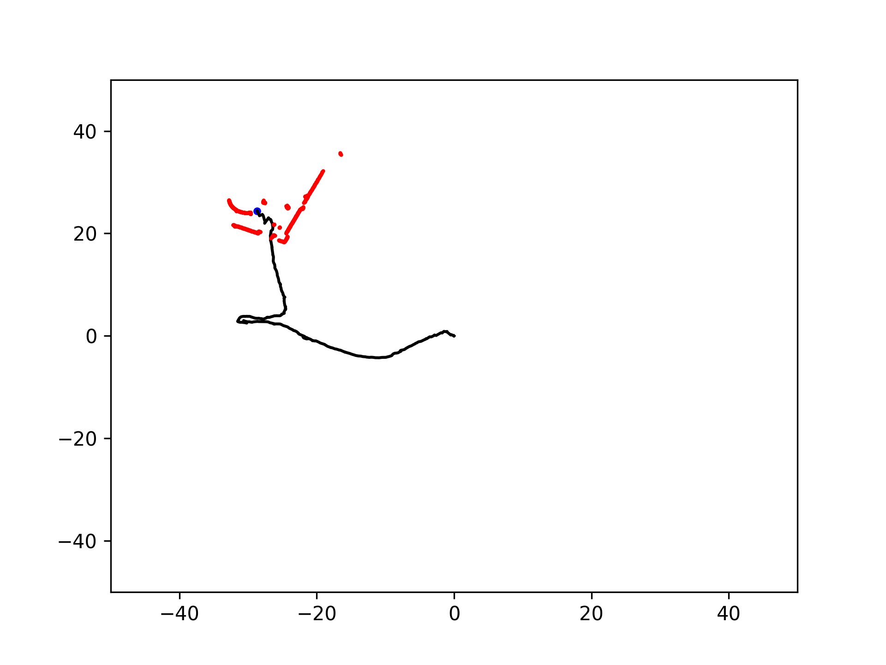

# Project 1
- 목적 : 10주동안 원하는 공부를 할 수 있는 힘을 키우기 위함
- 목표 : Lidar 또는 Camera를 이용하여 공간에서 물체 또는 사람을 찾는 것을 목표로 함 

### 세부목표 및 이론 관련 페이지
- [Lidar](https://leechaeyoung.notion.site/Project-1-6-week-c49e2e6a25a94d4eaaea8f429ecd9bb1?pvs=4)

## weeks

3주차

<!-- summary 아래 한칸 공백 두어야함 -->
1. Simple 2D LiDAR Odometry using ICP

2. https://define.tistory.com/entry/2D-LiDAR-Odometry-using-Simple-ICP

3. Example : Deutsches Museum Dataset

4. TEST RESULT

4주차 

<!-- summary 아래 한칸 공백 두어야함 -->
1. How to using 360cam
- [connection , simple](./360cam/README.md)
2. As a result of applying segmentation
- method : mask RCNN

3. Next weeks
- goals 1
    - Calibration of FISHEYE camera model
    - Method of 6dof pose estmation
- goals 2
    - Using Turtlebot SLAM!
    - To associate an estimated object pose on a map

5주차 

<!-- summary 아래 한칸 공백 두어야함 -->
## 접은 제목
접은 내용

6주차 

<!-- summary 아래 한칸 공백 두어야함 -->
## 접은 제목
접은 내용

7주차 

<!-- summary 아래 한칸 공백 두어야함 -->
## 접은 제목
접은 내용

8주차 

<!-- summary 아래 한칸 공백 두어야함 -->
## 접은 제목
접은 내용

9주차 

<!-- summary 아래 한칸 공백 두어야함 -->
## 접은 제목
접은 내용

10주차 

<!-- summary 아래 한칸 공백 두어야함 -->
## 접은 제목
접은 내용

### Reference
- [dataset](https://github.com/awesomedata/awesome-public-datasets)
- [OPENCR ROS2 Firmware update](https://leesangwon0114.github.io/ros2/2022/01/06/ROS2_TurtleBot3_3.OpenCR-%EC%84%A4%EC%B9%98.html)
