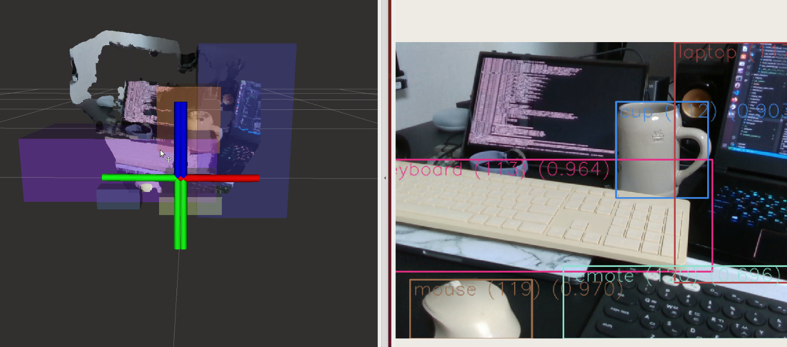

# Project 1
- 목적 : 10주동안 원하는 공부를 할 수 있는 힘을 키우기 위함
- 최종 목표 : Lidar 또는 Camera를 이용하여 공간에서 물체 또는 사람을 찾고, 또는 정리 정돈하는 로봇연구
- 프로젝트 목표
  - 360 camera에 대한 공부를 진행한다 => Object detection 수행
  - Lidar Map을 얻는다
  - camera를 연결하여 object map을 생성한다.
    - update 기준을 정한다.
      
## weeks

<details>
<summary>3주차</summary>

<!-- summary 아래 한칸 공백 두어야함 -->
1. Simple 2D LiDAR Odometry using ICP

2. https://define.tistory.com/entry/2D-LiDAR-Odometry-using-Simple-ICP

3. Example : Deutsches Museum Dataset


4. TEST RESULT


</details>


<details>
<summary>4주차 </summary>

<!-- summary 아래 한칸 공백 두어야함 -->
1. How to using 360cam
- [connection , simple](./360cam/README.md)
2. As a result of applying segmentation
- method : mask RCNN


3. Next weeks
- goals 1
    - Calibration of FISHEYE camera model
    - Method of 6dof pose estmation
- goals 2
    - Using Turtlebot SLAM!
    - To associate an estimated object pose on a map
</details>
<details>
<summary>5주차 </summary>

<!-- summary 아래 한칸 공백 두어야함 -->
## ROS2 with Yolov8
- [Reference - ROS2 & Yolov8](https://github.com/mgonzs13/yolov8_ros)
- [Reference - ROS2 & Realsense2](https://github.com/2b-t/realsense-ros2-docker)


### How to run 
```
$ ros2 launch realsense2_camera rs_launch.py pointcloud.enable:=true
$ ros2 launch yolov8_bringup yolov8.launch.py
```
</details>


<details>
<summary>6주차 </summary>

<!-- summary 아래 한칸 공백 두어야함 -->


</details>

<details>
<summary>7주차 </summary>

<!-- summary 아래 한칸 공백 두어야함 -->
### SLAM 관련 공부
- [Link](https://1ch02ch0.notion.site/SLAM-446d51e936c441189478b773f9e8eb12?pvs=4)
</details>

<details>
<summary>8주차 </summary>

<!-- summary 아래 한칸 공백 두어야함 -->
- [TF publisher](./src/tf.py)
</details>

<details>
<summary>9주차 </summary>

<!-- summary 아래 한칸 공백 두어야함 -->
## Todo
- [x] To make original map using 2D LiDAR
- [x] To make Object map using camera
- [x] Matching & Update
---
### To make original map using 2D LiDAR
- ros2 launch turtlebot3_navigation2 navigation2.launch.py use_sim_time:=true map:=map.yaml

### To make Object map using camera
- [x] camera_link <- target frame setup

- To make object map
- If the newly recognized object is class that was existing, update it when it falls more than 50cm from the existing position
- [result](https://github.com/CYLoung/yolov8_ros.git)

</details>

<details>
<summary>10주차 </summary>

<!-- summary 아래 한칸 공백 두어야함 -->
## Todo
- [ ] Connect map (SLAM map & Object Map)
접은 내용
</details>


### Reference
- [dataset](https://github.com/awesomedata/awesome-public-datasets)
- [OPENCR ROS2 Firmware update](https://leesangwon0114.github.io/ros2/2022/01/06/ROS2_TurtleBot3_3.OpenCR-%EC%84%A4%EC%B9%98.html)
